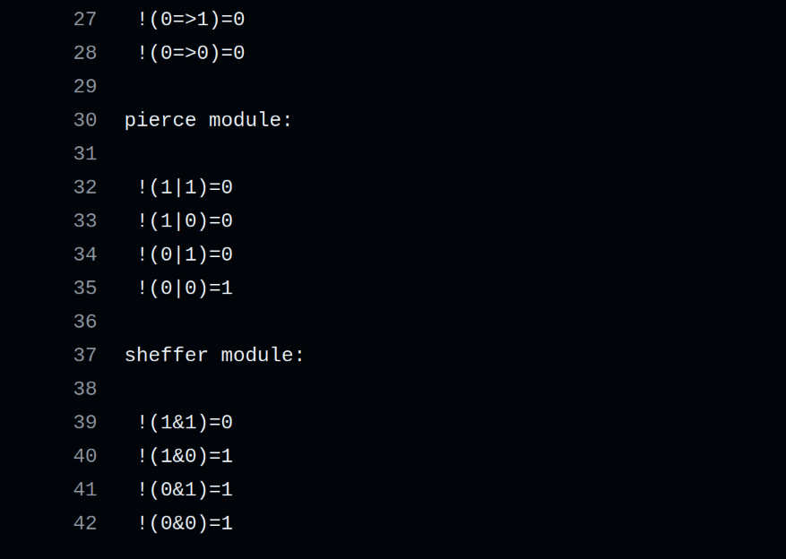
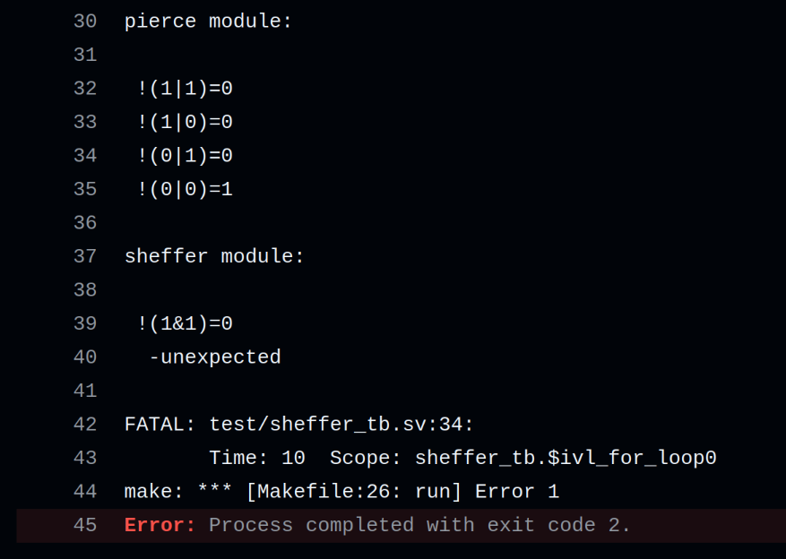

# Verilog Basic Modules

## Run

```shell
    # install iverilog
    # install verible

    make

    # check console output

    # install Yosys
    # install npm
    # gen_svg.sh: edit $yosys_env_dir 

    ./gen_svg.sh

    # check readme.md table
```

## Modules

| code                         | scheme                            |
|:----------------------------:|:---------------------------------:|
| [add](code/add.sv)           |            |
| [impl](code/impl.sv)         |          |
| [not_impl](code/not_impl.sv) |  |
| [pierce](code/pierce.sv)     |      |
| [sheffer](code/sheffer.sv)   |    |

## CI demo

| good                         | error                          |
|:----------------------------:|:------------------------------:|
|  |  |

## Todo

- [ ] CI: Yosys
- [ ] code quote
